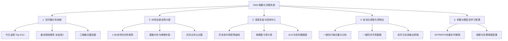

# 🌌 快乐8全栈量化决策系统 (K8-Quant Web) — 产品需求规格说明书 (PRD v1.0)

> **文档定位**：本文档定义了将现有 Python 量化内核全面重构升级为现代化 Web 端应用系统的整体产品需求、系统架构、接口契约与交互设计规范。
> **交互原则**：严格遵循《全局执行协议 V7.0 - 大白话落地架构》，全系统采用通俗易懂的量化老派操盘手大白话，杜绝抽象学术神父词汇，关键指标强制附带大白话释义。

---

## 1. 系统建设目标与定位 (System Vision)

### 1.1 建设背景
现有的 KL8 量化系统已经具备扎实的数据采集、特征工程、三维融合模型（EF/RW/FO）、定金选2、香农熵补偿与自主学习引擎，但交互形态局限于本地脚本与 Excel 报表。
为了提升操盘决策效率、降低运行维护门槛，并实现直观震撼的数据可视化，需要打造一套集 **“实时量化驾驶舱 + 80码全景态势大屏 + 历史复盘审计中心 + 自动化流水线调度控制台”** 于一体的现代化 Web 决策系统。

### 1.2 核心目标
1. **视觉冲击力与专业感**：采用**极致暗黑赛博量化大屏（Cyber Dark Quant）**风格，高对比度荧光、冷光数据卡片与动态数据热力图。
2. **端到端一键闭环**：前端可一键触发历史开奖数据同步、每日量化分析运算、自动生成复盘审计报告，并支持实时终端日志流展示。
3. **大白话人机交互**：所有量化指标（如 EF 能量场、RW 冷号回补、FO 周期谐波、胜率警告、物理熔断等）均配有大白话解释，通俗直观。
4. **轻量高性能交付**：前后端解耦，后端采用高性能 FastAPI 异步架构，前端采用响应式现代化界面 + ECharts 5 高性能图表库，支持一键脚本双击启动。

---

## 2. 核心业务术语与大白话对照表 (Glossary)

| 核心黑话 | 操盘手大白话 | 业务真实含义 |
| :--- | :--- | :--- |
| **三维融合打分 (Trinity Scoring)** | **三维合力打分 (EF/RW/FO)** | 把“蹭热度(EF)”、“抓冷门(RW)”、“找周期(FO)”三个维度的得分加权相加，综合挑出最具潜力的号码 |
| **能量场 (Energy Field / EF)** | **蹭热度** | 统计近期开奖号码在周围产生的局部热能扩散，挑出当前最炙手可热的号段 |
| **遗漏回补 (Random Walk / RW)** | **抓冷门/守号** | 挑出憋了很久没出（遗漏期数长）的号码，赌其均值回归即将反弹回补 |
| **傅里叶周期 (Fourier / FO)** | **找周期** | 算算号码是不是按固定天数循环出现（如每隔 3 期出一次） |
| **定金选2 (Pair Selector)** | **最佳搭档/连体婴** | 历史大数据中绑定最紧密、最爱成对开出的两个号码组合 |
| **胜率警告机制 (Beacon Alert)** | **胜率警告** | 回测发现今日推荐号码的历史有效信标不足时，自动提示缩减投入 |
| **物理熔断 (Circuit Breaker)** | **紧急刹车** | 当全局信号极度紊乱或置信度偏低时，强制限制推荐数量以防爆仓 |
| **香农熵补偿 (Shannon Entropy)** | **尾数平衡补偿** | 当上一期尾数分布极不均匀（如某个尾数全灭）时，给予高额补偿权重 |

---

## 3. 功能模块规划与详细需求 (Functional Specifications)

### 3.1 模块一：实时量化驾驶舱 (Live Quant Cockpit)
- **Top 5 核心金胆卡片**：高亮展示今日系统综合评分最高的 5 个号码，附带各号的得分与优势标签（如“热度爆发”、“冷号憋到极限”、“强周期循环”）。
- **Top 12 核心候选池**：展示第二梯队 7 个备选号码及综合得分。
- **定金选2（最佳搭档）看板**：展示 3 组最高共现概率的双码组合（如 `[08, 19]`, `[23, 45]`, `[67, 72]`）及其历史关联度评分。
- **三维模型雷达图 (EF/RW/FO Radar)**：直观展示当前权重配比与各维度的能量分布。
- **操盘风控信标卡 (Risk Radar)**：显示当前风控状态（正常/胜率警告/紧急刹车）、大盘混沌度、建议持仓与防守策略。

### 3.2 模块二：80码全景态势大屏 (80-Number Heatmap & Trend Matrix)
- **80 码冷热蜂巢/矩阵热力图**：8 行 10 列网格（1-80 号），单元格颜色根据当前综合能量动态渲染（极热-红/橙荧光，温和-青绿，冰冷-深灰蓝）。
- **点击号码钻取详情 (Number Modal)**：点击任意号码卡片，弹出该号码的近 30 期开奖走势、遗漏走势、周期频率、搭档号码 Top 3。
- **0-9 尾数分布与香农熵监控**：柱状图展示最新期 10 个尾数的出号频次，标示出“全灭尾数（强力补偿）”和“过热尾数”。
- **四分区态势对比（一区 1-20、二区 21-40、三区 41-60、四区 61-80）**：展示区间出号均衡度与偏度。

### 3.3 模块三：深度复盘与回测中心 (Audit & Backtest Hub)
- **历史命中率走势折线图**：展示最近 30 期 Top 5 与 Top 12 的实际命中趋势（均值参考线：Top5 均中 1.8~2.5 码）。
- **历史报表归档浏览器**：自动读取 `reports/` 目录下所有 `daily_analysis_report_*.md` 报告，支持一键切换期号在线阅读与 Markdown 渲染。
- **模型胜率与 AUC 审计**：展示系统自主学习状态、历史模拟盈亏、多重假设检验（FDR 校正）健康状态。

### 3.4 模块四：自动化调度与控制台 (Pipeline & Auto-Scheduler Console)
- **快捷动作按钮组**：
  1. ⚡ **一键执行每日量化预测 (Run Full Pipeline)**
  2. 🔄 **一键同步历史开奖数据 (Fetch & Sync Data)**
  3. 📑 **生成并下载格式化 Excel 报表**
- **实时终端日志 (Live Log Streamer)**：模拟黑客终端窗口，通过流式接口实时输出 Python 脚本的标准输出与报错，支持一键清屏与自动滚动。
- **执行状态通知**：任务运行中禁用重复点击，显示加载中动画；完成后弹出 Toast 提示并自动刷新所有大屏图表。

### 3.5 模块五：参数与模型自学习管理 (Model Config & Parameters)
- **动态权重微调**：滑块调节 EF（蹭热度）、RW（抓冷门）、FO（找周期）的融合权重，实时预览对打分排名的影响。
- **熔断阈值设定**：配置胜率警告降级系数与紧急刹车敏感度。
- **一键恢复默认策略**：快速重置为系统自学习的最佳平衡参数。

---

## 4. 系统技术架构与接口契约设计 (Architecture & API Specs)

### 4.1 技术栈选型
| 层级 | 技术选型 | 说明 |
| :--- | :--- | :--- |
| **后端框架** | **FastAPI + Uvicorn** | Python 3.10+ 原生异步，轻量高性能，与原有量化脚本无缝对接 |
| **数据序列化**| **Pydantic v2** | 严格的输入输出契约校验，自动生成 OpenAPI / Swagger 文档 |
| **前端架构** | **Vue 3 / Vanilla SPA + TailwindCSS** | 现代化暗黑赛博 UI，无额外庞大构建链即可快速运行 |
| **可视化图表**| **Apache ECharts 5.x** | 高性能 Canvas/SVG 图表渲染，支持热力图、雷达图、折线走势图 |
| **前后端通信**| **RESTful API + Server-Sent Events / Log Stream** | 保证数据请求极速响应与控制台日志实时流式传输 |

### 4.2 RESTful API 核心接口列表

| 方法 | 接口路径 | 描述 | 请求参数 | 返回内容 |
| :--- | :--- | :--- | :--- | :--- |
| `GET` | `/api/system/status` | 获取系统健康度、版本与最新期号 | 无 | 状态码、版本、最新期号、当前时间 |
| `GET` | `/api/quant/latest-prediction`| 获取最新一期量化预测与推荐核心 | 无 | Top5/12 号码、综合打分、定金选2、风控状态 |
| `GET` | `/api/quant/matrix-80` | 获取 1-80 号码多维态势与热力图数据 | 无 | 每个号码的能量值、遗漏值、冷热标签、尾数 |
| `GET` | `/api/quant/history-trends` | 获取近期开奖走势与模型命中历史 | `limit=30` | 历史期号列表、开奖号码、Top5命中数、Top12命中数 |
| `GET` | `/api/reports/list` | 获取历史每日分析报告列表 | 无 | 报告日期列表、期号、命中摘要 |
| `GET` | `/api/reports/detail/{date}` | 获取指定日期的报告 Markdown 内容 | 日期字符串 | 报告全文、元数据 |
| `POST`| `/api/pipeline/run` | 触发全流程每日量化计算 | `async_mode=true` | 任务 ID、初始状态 |
| `GET` | `/api/pipeline/logs/{task_id}`| 实时获取流水线执行日志流 | 任务 ID | 日志文本流 / JSON 状态 |
| `POST`| `/api/pipeline/sync-data` | 触发数据同步脚本 | 无 | 任务状态 |
| `GET` | `/api/config/params` | 读取当前模型权重与运行参数 | 无 | EF/RW/FO 权重、熔断参数 |
| `POST`| `/api/config/params` | 更新模型参数 | 权重字典 | 更新结果与状态 |

---

## 5. UI/UX 视觉与交互设计规范 (UI Specification)

### 5.1 视觉色彩系统 (Cyber Quant Dark Palette)
- **背景主底色 (Background)**: `#0B0F19`（深邃暗黑夜空底）
- **卡片/面板底色 (Card Surface)**: `#111827` / `#1F2937`（带有微弱蓝灰调的半透明磨砂质感玻璃态）
- **核心主品牌色 (Primary Cyan)**: `#06B6D4` / `#22D3EE`（高亮赛博青，代表科技与核心指标）
- **高能/金胆高亮色 (Gold Core)**: `#F59E0B` / `#FBBF24`（金光璀璨，用于 Top 5 金胆与最佳搭档）
- **热号/能量爆发色 (Hot Energy)**: `#EF4444` / `#F87171`（炽热红，代表能量场爆发与极热点位）
- **冷号/遗漏反弹色 (Cold Rebound)**: `#8B5CF6` / `#A78BFA`（神秘紫，代表冷号憋到极限回补）
- **成功/健康信标 (Success Green)**: `#10B981` / `#34D399`（荧光翡翠绿，代表正常运行与高命中）
- **文本颜色 (Typography)**: 标题 `#F9FAFB`（纯白高亮），正文 `#E5E7EB`，副文/大白话备注 `#9CA3AF`

---

## 6. 验收与交付标准 (Acceptance Criteria)

1. **需求与架构文档落地**：本 PRD 完整归档至 `docs/web_system_prd.md`，所有接口与数据结构定义清晰。
2. **UI 设计图落地**：提供高保真暗黑赛博大屏 UI 视觉概念图与前端组件规范说明。
3. **前端系统全栈开发**：完成完整的现代化 Web 交互界面，实现 80 码矩阵热力图、走势图、Top 5/12 看板、雷达图与操作面板。
4. **后端 API 封装与联调**：完成 FastAPI 服务端实现，所有 RESTful 接口通过自动化测试与前后端端到端联调。
5. **一键启动交付**：提供 `start_web.bat` 和 `run_server.py`，双击或单条命令即可启动并在浏览器中无缝体验。
